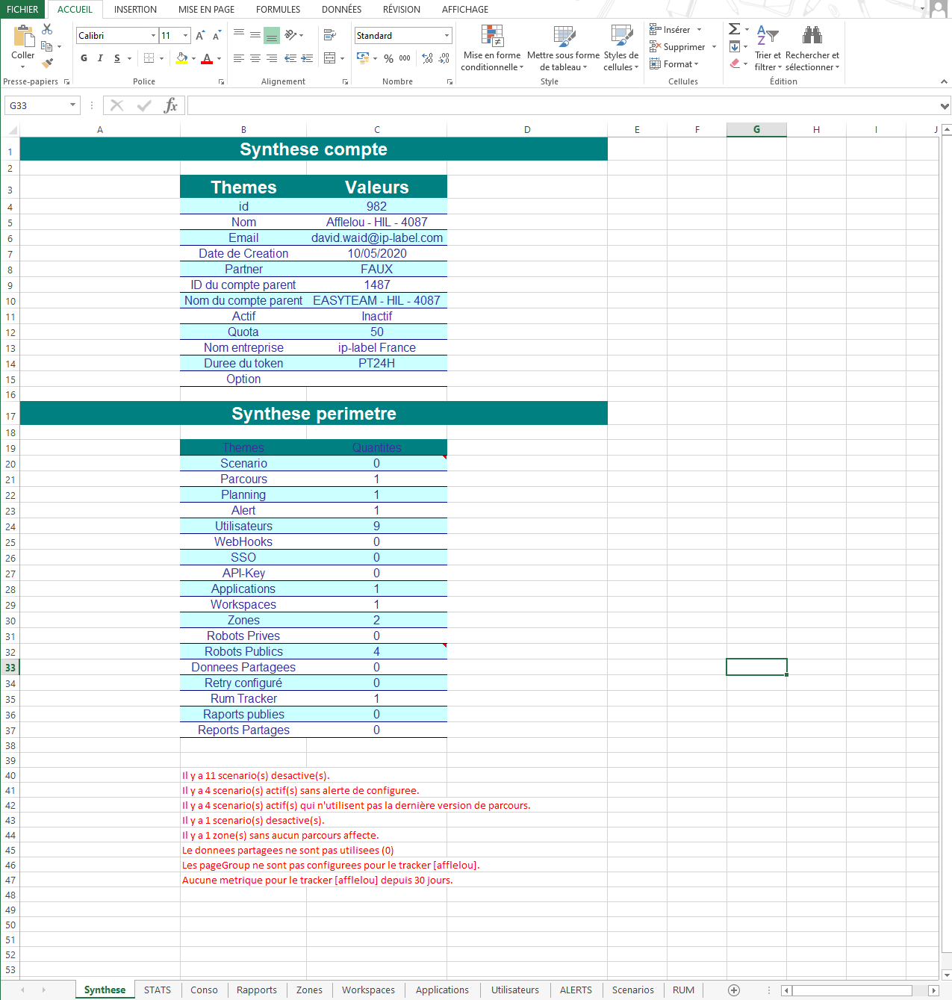

# Ekara-Inventory

<a href="https://api.ekara.ip-label.net/"> 

## Description
This script [Powershell](https://learn.microsoft.com/powershell/scripting/overview) allows you to take inventory of the different elements of the [Ekara](https://ekara.ip-label.net/) environment and generates an Excel file.

For this, the script uses the Rest Ekara API.

## Screens

## Requirements

Powershell|version
--|:--:
PSVersion|5.1.19041.3803
PSCompatibleVersions|{1.0, 2.0, 3.0, 4.0...}
BuildVersion|10.0.19041.3803
CLRVersion|4.0.30319.42000

Account and password Ekara

## Download

[github-download]: https://github.com/MrGuyTwo/Ekara-Inventory/releases
 - [`Ekara-Inventory`][github-download]

## The main function
Methods called : 

- auth/login
- adm-api/clients
- adm-api/client/users
- adm-api/scenarios
- adm-api/plannings
- adm-api/alerts
- script-api/script
- script-api/scripts
- adm-api/applications
- adm-api/workspaces
- adm-api/zones
- adm-api/sites
- adm-api/actions
- adm-api/reports/views
- adm-api/reports/schedules
- rum-restit/trk
- rum-restit/metrics
- rum-restit/trk/$trackerID/results/$metricID/overview
- rum-restit/trk/$trackerID/urlgroups
- rum-restit/customdim/business
- rum-restit/customdim/custom
- rum-restit/customdim/infra
- rum-restit/customdim/version

 
